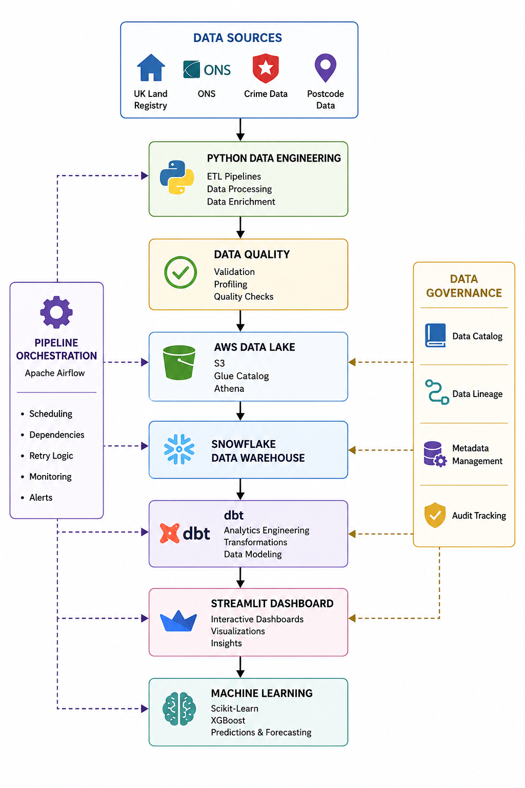
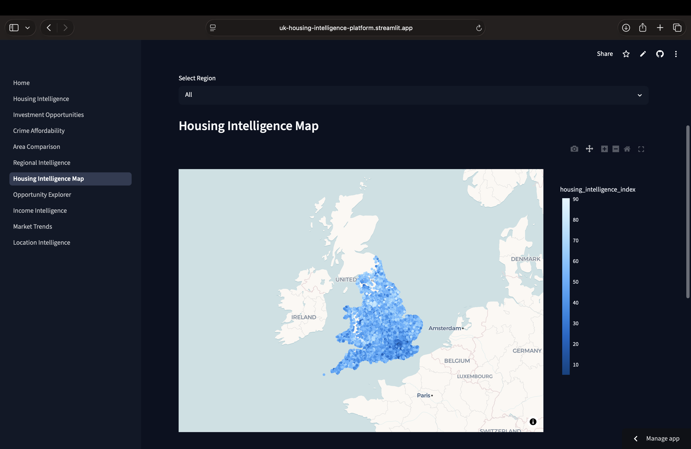
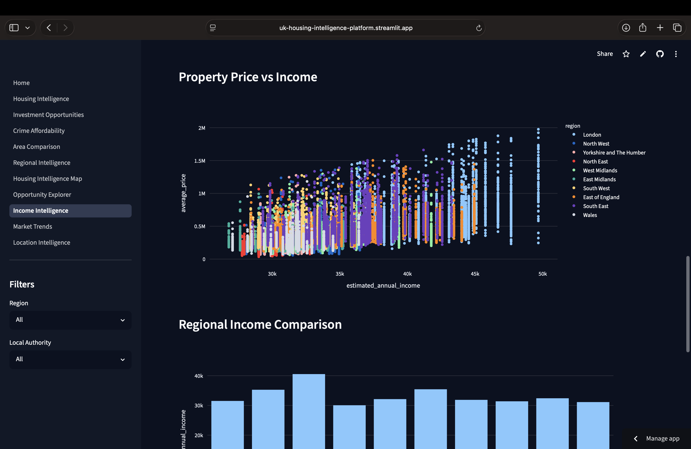
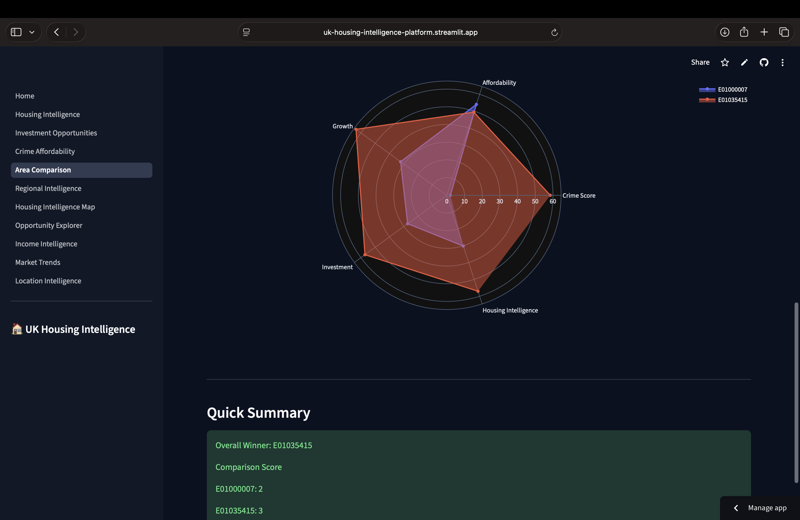

# UK Housing Intelligence Platform

An end-to-end Data Engineering and Data Science project designed to analyze the UK housing market.

## Live Dashboard

https://uk-housing-intelligence-platform.streamlit.app/

## Architecture Diagram

## Project Overview

The UK Housing Intelligence Platform combines multiple UK datasets to create an intelligence-driven view of housing markets at LSOA level.

The platform provides:

* Housing Intelligence Scoring
* Investment Opportunity Analysis
* Crime & Affordability Analysis
* Area Rankings
* Area Comparison Tools
* Interactive Dashboard

## Current Geographic Coverage

The current version of the UK Housing Intelligence Platform covers:

- England
- Wales

The platform currently leverages HM Land Registry, UK Police Crime Data, ONS Geography Data, and ONS Earnings (ASHE) Data.

## Future Expansion

Future releases will incorporate:

- Scotland property data
- Northern Ireland property data
- UK-wide geographic harmonisation
- Full UK Housing Intelligence coverage

## Dashboard Screenshots

For all dashboard screenshots, see:

[Dashboard Gallery](docs/dashboard-gallery.md)

## Technology Stack

### Data Engineering

* Python
* Pandas
* AWS S3
* AWS Glue Data Catalog
* Amazon Athena
* Snowflake
* dbt
* Apache Airflow
* Terraform
* GitHub

### Analytics

* Streamlit
* Plotly

### Data Science

* Scikit-learn
* XGBoost

### Data Governance

* Data Quality Validation (Python)
* dbt Tests
* Metadata Management
* Data Catalog
* Data Lineage Documentation

## Data Governance

The platform incorporates data governance practices throughout the data lifecycle, including:

* Data quality validation
* Metadata management
* Data lineage tracking
* Data cataloging
* Auditability and traceability

Governance controls will be implemented using Python validation rules, Snowflake metadata columns, dbt tests, and project documentation.

## Documentation

* Project Scope
* Business Questions
* Data Sources
* Architecture
* Data Governance
* Data Catalog
* Data Lineage
* Roadmap

## External Data Sources

The following datasets are not stored in this repository because of their size:

- ONS Postcode Directory
- UK House Price Data
- UK Crime Data

Place downloaded datasets in:

data/reference/
data/external/
data/raw/

See the data acquisition instructions below for download links.

## Exploratory Data Analysis Highlights

The project includes exploratory analysis of major UK housing and crime datasets.

## Property Market Analysis

* UK Land Registry property transactions (2023–2026)
* Property price distributions
* Property type analysis
* County-level housing market analysis
* Data quality assessment

## Crime Analysis

* UK Police crime data (April 2026)
* Crime category analysis
* Police force analysis
* Crime distribution analysis

## dbt Data Lineage

The platform uses dbt to transform Snowflake RAW datasets into
business-ready dimensional models and marts.

### Lineage Graph

[final screenshot]

## Analytics Engineering Framework

The UK Housing Intelligence Platform follows a layered analytics engineering architecture:

RAW → STAGING → INTERMEDIATE → DIMENSIONS → FACTS → MARTS

The warehouse is implemented using Snowflake and dbt.

Primary consumption layer:
- Streamlit Dashboard

Future consumption layers:
- Machine Learning Models
- Airflow Pipelines
- External APIs

Outputs

Visualisations generated during the EDA phase are available in:

outputs/plots/

EDA reports are available in:

reports/eda/

## Current Status

Phase 7 Completed